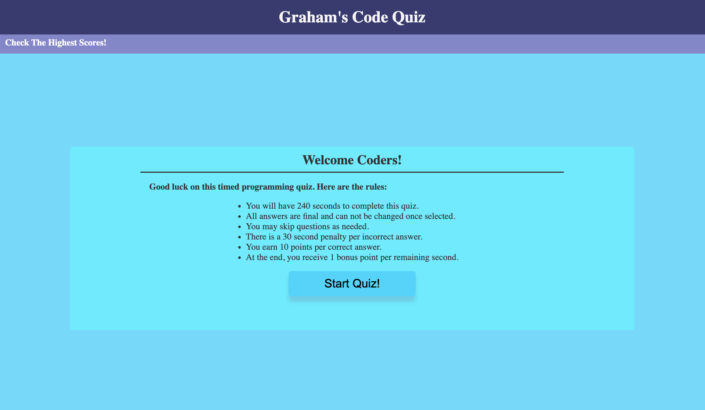

# code-quiz

## Purpose
Coding Quiz

## User Story
AS A coding boot camp student
I WANT to take a timed quiz on JavaScript fundamentals that stores high scores
SO THAT I can gauge my progress compared to my peers

## Acceptance Criteria
GIVEN I am taking a code quiz
WHEN I click the start button
THEN a timer starts and I am presented with a question
WHEN I answer a question
THEN I am presented with another question
WHEN I answer a question incorrectly
THEN time is subtracted from the clock
WHEN all questions are answered or the timer reaches 0
THEN the game is over
WHEN the game is over
THEN I can save my initials and score

## Usage
This is a website that consists in a code challenge/quiz! 
You will have 240 seconds to complete the quiz. 
Answers are final and can not be changed once selected. 
You may skip questions. 
30 penalty per incorrect answers. 
10 points per correct answer. 
At the end every second left gives you 1 point. 
at the end you can retake the quiz or see the highest scores stored on local repo. 

## Technologies Used
HTML
CSS
JavaScript

## Screenshot

## Deployed Application
Deployed application URL: <a href="https://gr4ham18.github.io/code-quiz/"> https://gr4ham18.github.io/code-quiz/ </a> Good Luck!
